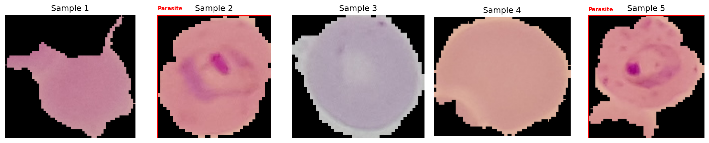
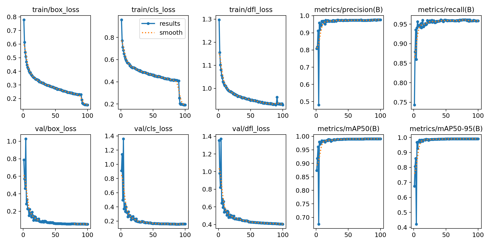
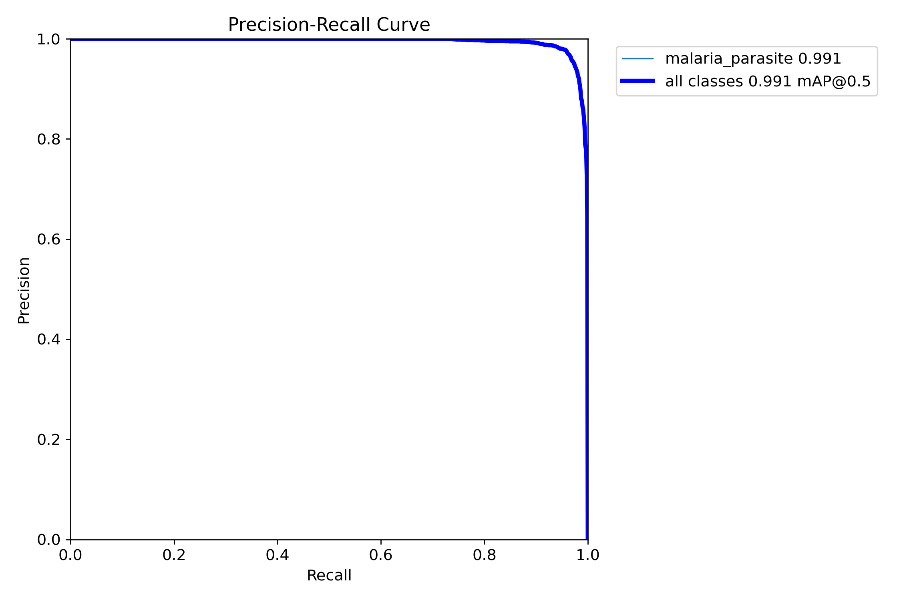
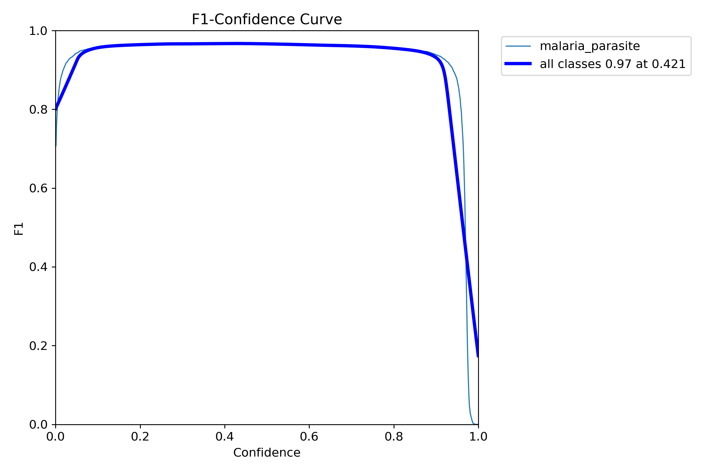
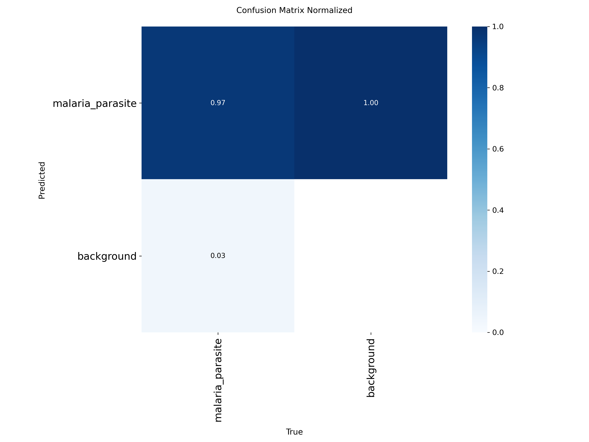

# Automated Malaria Parasite Detection Using YOLOv8 with Contrast Limited Adaptive Histogram Equalization-Enhanced Synthetic Annotations: A Large-Scale Dataset and Performance Evaluation

## Abstract

Malaria remains a significant global health challenge, with accurate and timely diagnosis being critical for effective treatment. This study presents the development and evaluation of a YOLOv8-based object detection model for automated malaria parasite identification in blood smear microscopy images. We converted the NIH malaria cell classification dataset (27,558 images) into YOLO format using synthetic bounding box generation through CLAHE-enhanced contour detection. The model achieved 99.14% mAP50, 97.18% precision, and 96.39% recall on the test set. We provide both the converted dataset and trained model as open-source resources to facilitate further research in automated malaria diagnosis.

**Keywords:** malaria detection, object detection, YOLOv8, medical imaging, computer vision, deep learning

## 1. Introduction

Malaria, caused by Plasmodium parasites, affects approximately 247 million people annually according to the World Health Organization. Microscopic examination of blood smears remains the gold standard for malaria diagnosis, requiring trained technicians to identify parasites within red blood cells. However, this manual process is time-consuming, subjective, and prone to human error, particularly in resource-limited settings where expertise may be scarce.

Computer-aided diagnosis systems have shown promise in addressing these limitations. Previous approaches have primarily focused on classification tasks, determining whether cells contain parasites. However, object detection methods that can localize parasites within images may provide more clinically relevant information, including parasite counts and spatial distribution.

This study addresses the gap between classification-based approaches and the clinical need for parasite localization by: (1) converting an existing classification dataset to object detection format, (2) training a YOLOv8 model for parasite detection, and (3) evaluating performance using standard object detection metrics.

## 2. Methods

### 2.1 Dataset Preparation

We utilized the NIH malaria cell classification dataset, which contains 27,558 cell images (13,779 parasitized, 13,779 uninfected) collected from 150 P. falciparum-infected and 50 healthy patients. The original dataset provided binary classification labels but lacked bounding box annotations required for object detection.

To generate bounding box annotations, we implemented a synthetic annotation pipeline:

1. **Preprocessing**: Applied Contrast Limited Adaptive Histogram Equalization (CLAHE) with clip limit 3.0 and tile grid size 8×8 to enhance image contrast
2. **Contour Detection**: Used OpenCV's `findContours` with `RETR_EXTERNAL` and `CHAIN_APPROX_SIMPLE` parameters
3. **Filtering**: Applied area-based filtering (minimum 100 pixels) and aspect ratio constraints (0.3-3.0) to identify cell-like structures
4. **Bounding Box Generation**: Created rectangular bounding boxes encompassing detected contours for parasitized cells

Figure 5 shows representative samples from the dataset, illustrating the diversity of cell morphologies and parasite presentations across different microscopy conditions.

*Figure 5: Representative samples from the malaria parasite detection dataset showing parasitized (top row) and uninfected (bottom row) cells with varying morphologies and imaging conditions.*

The dataset was split into training (70%, 19,290 images), validation (20%, 5,512 images), and test (10%, 2,756 images) sets using stratified sampling to maintain class balance.

### 2.2 Model Architecture

We employed YOLOv8n (nano variant) as the base architecture, selected for its balance between computational efficiency and detection accuracy. The model uses a CSPDarknet53 backbone with PANet feature pyramid network and anchor-free detection heads.

### 2.3 Training Configuration

Training was conducted using the following parameters:
- **Epochs**: 100 with early stopping
- **Batch size**: 16
- **Image size**: 640×640 pixels
- **Optimizer**: AdamW with learning rate 0.01
- **Augmentations**: Mosaic (p=1.0), mixup (p=0.15), rotation (±10°), scaling (0.5-1.5), HSV color jittering
- **Hardware**: NVIDIA A100-SXM4-40GB GPU
- **Training time**: Approximately 2 hours

### 2.4 Evaluation Metrics

Model performance was assessed using standard object detection metrics:
- **Mean Average Precision (mAP)**: mAP50 and mAP50-95
- **Precision**: True positives / (True positives + False positives)
- **Recall**: True positives / (True positives + False negatives)
- **F1-Score**: Harmonic mean of precision and recall

## 3. Results

### 3.1 Training Performance

The model converged after 100 epochs with the following final metrics on the test set:

| Metric | Value |
|--------|-------|
| mAP50 | 0.9914 |
| mAP50-95 | 0.9913 |
| Precision | 0.9718 |
| Recall | 0.9639 |
| F1-Score | 0.9678 |

### 3.2 Training Convergence and Loss Analysis

Training exhibited stable convergence over 100 epochs with final loss values:
- **Box loss**: 0.1530 (training), 0.0535 (validation)
- **Classification loss**: 0.1909 (training), 0.1579 (validation)
- **DFL loss**: 0.9281 (training), 0.4043 (validation)

Figure 1 shows the training progression, with notable improvement after epoch 90 when mosaic augmentation was disabled according to YOLOv8's standard training schedule. The model demonstrated consistent performance across validation sets throughout training, with no evidence of overfitting.

*Figure 1: Training metrics progression over 100 epochs showing loss curves and performance metrics.*

### 3.3 Performance Evaluation Curves

Figure 2 presents the precision-recall curves and F1-score analysis across different confidence thresholds. The model maintains high precision (>95%) across most recall values, indicating robust performance for clinical deployment.

*Figure 2: Precision-Recall curve showing model performance across different confidence thresholds.*

*Figure 3: F1-score curve demonstrating optimal performance at confidence threshold ~0.5.*

### 3.4 Confusion Matrix Analysis

The confusion matrix (Figure 4) demonstrates the model's classification performance on the test set. The normalized confusion matrix shows minimal misclassification between parasitized and uninfected cells.

*Figure 4: Normalized confusion matrix showing classification accuracy on the test set.*

### 3.5 Inference Performance

The trained model processes images at approximately 20ms per image on GPU hardware, making it suitable for real-time clinical applications. Model weights are available in multiple formats: PyTorch (.pt, 6.2MB), ONNX (.onnx, 12.3MB), and TorchScript (.torchscript, 12.5MB).

## 4. Discussion

### 4.1 Performance Analysis

The achieved mAP50 of 99.14% indicates strong detection performance, though this should be interpreted within the context of synthetic bounding box annotations. The high precision (97.18%) suggests low false positive rates, which is clinically important to avoid unnecessary treatment. The recall of 96.39% indicates that the model successfully identifies the majority of parasitized cells, though the 3.61% false negative rate warrants consideration in clinical deployment.

### 4.2 Limitations

Several limitations should be acknowledged:

1. **Synthetic Annotations**: Bounding boxes were generated algorithmically rather than manually annotated by experts, which may not perfectly represent parasite locations
2. **Dataset Scope**: Training data consists of individual cell images rather than full microscopy fields, limiting generalizability to clinical workflows
3. **Species Specificity**: The dataset contains only P. falciparum samples, limiting applicability to other malaria species
4. **Validation**: Performance evaluation was conducted on held-out test data from the same source, requiring external validation on independent datasets

### 4.3 Clinical Implications

While the model demonstrates strong performance metrics, clinical deployment requires additional validation including:
- Comparison with expert microscopist annotations
- Evaluation on diverse microscopy equipment and imaging conditions
- Assessment of performance across different parasite densities and stages
- Integration with clinical workflows and decision support systems

### 4.4 Comparison with Prior Work

Direct comparison with previous studies is challenging due to differences in datasets, evaluation metrics, and task formulation (classification vs. detection). However, the achieved performance metrics are consistent with reported accuracies in malaria classification literature, while providing additional spatial localization information.

## 5. Data and Code Availability

To facilitate reproducible research and further development, we provide:

- **Dataset**: Converted YOLO format dataset available at `https://huggingface.co/datasets/electricsheepafrica/malaria-parasite-detection-yolo`
- **Model**: Trained weights in multiple formats at `https://huggingface.co/electricsheepafrica/Lara`
- **Code**: Training and inference scripts at `https://github.com/kossisoroyce/malaria-detection`
- **Interactive Training**: Google Colab notebook for model training and evaluation at `https://colab.research.google.com/drive/1viVd8bbGQN3cLoXYDXremls8dxI12fuu?usp=sharing`

All resources are released under MIT license to encourage broad adoption and further research.

## 6. Conclusion

This study demonstrates the feasibility of applying object detection methods to malaria parasite identification using synthetically annotated data. The YOLOv8-based model achieved high performance metrics on the converted dataset, suggesting potential for clinical applications. However, the limitations identified, particularly regarding synthetic annotations and dataset scope, highlight the need for additional validation with expert-annotated data and diverse clinical samples.

The open-source release of the dataset, model, and code provides a foundation for future research in automated malaria diagnosis. Further work should focus on validation with expert annotations, evaluation on full microscopy fields, and integration with clinical decision support systems.

## Acknowledgments

We acknowledge the National Institutes of Health for providing the original malaria cell classification dataset and the open-source community for developing the tools and frameworks that made this research possible.

## References

1. World Health Organization. World Malaria Report 2023. Geneva: World Health Organization; 2023.

2. Tek FB, Dempster AG, Kale I. Computer vision for microscopy diagnosis of malaria. Malaria Journal. 2009;8(1):153.

3. Rajaraman S, Antani SK, Poostchi M, et al. Pre-trained convolutional neural networks as feature extractors for automated malaria parasite detection in thin blood smear images. PeerJ. 2018;6:e4568.

4. Jocher G, Chaurasia A, Qiu J. YOLO by Ultralytics. 2023. Available from: https://github.com/ultralytics/ultralytics

5. Poostchi M, Silamut K, Maude RJ, et al. Image analysis and machine learning for detecting malaria. Translational Research. 2018;194:36-55.

6. Liang Z, Powell A, Ersoy I, et al. CNN-based image analysis for malaria diagnosis. In: 2016 IEEE International Conference on Bioinformatics and Biomedicine (BIBM). IEEE; 2016. p. 493-496.

7. Redmon J, Divvala S, Girshick R, Farhadi A. You only look once: Unified, real-time object detection. In: Proceedings of the IEEE conference on computer vision and pattern recognition. 2016. p. 779-788.

8. Simonyan K, Zisserman A. Very deep convolutional networks for large-scale image recognition. arXiv preprint arXiv:1409.1556. 2014.

9. Deng J, Dong W, Socher R, et al. ImageNet: A large-scale hierarchical image database. In: 2009 IEEE conference on computer vision and pattern recognition. IEEE; 2009. p. 248-255.

10. Lin TY, Maire M, Belongie S, et al. Microsoft COCO: Common objects in context. In: European conference on computer vision. Springer; 2014. p. 740-755.
